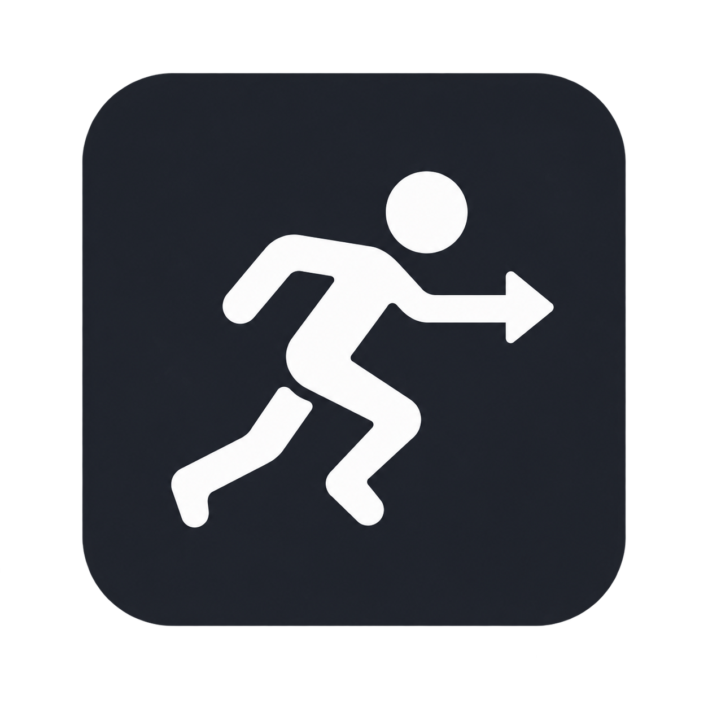
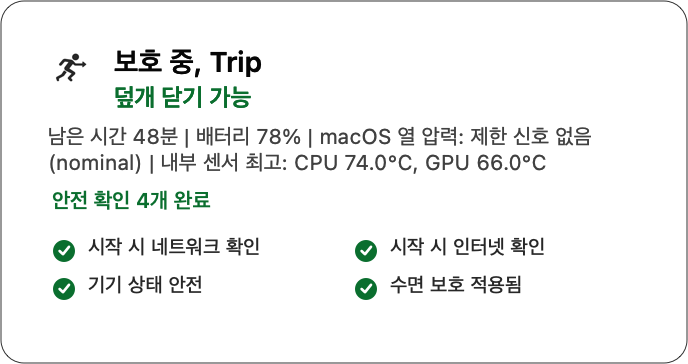
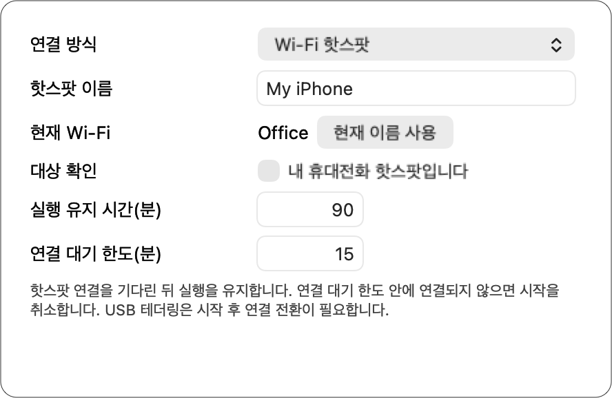
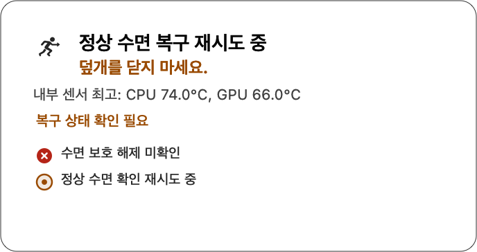

<p align="center">
  
</p>

<h1 align="center">Runtinue</h1>

<p align="center">
  <strong>작업은 계속. 덮개는 확인 후.</strong>
</p>

<p align="center">
  MacBook에서 실행 중인 로컬 에이전트 작업을<br>
  회사와 집 사이를 이동하는 동안 휴대전화 핫스팟으로 이어가는 macOS 메뉴바 앱
</p>

<p align="center">
  
</p>

## 현재 상태

> [!IMPORTANT]
> **현재 개발 버전은 루트의 [VERSION](VERSION) 파일을 기준으로 하며 아직 실험 단계입니다.** Apple Silicon MacBook과 macOS 13 이상을 지원합니다. 공개 GitHub Release나 서명과 공증을 마친 설치 패키지는 아직 없습니다. 자동화 테스트를 구성했습니다. 모든 MacBook과 실제 통근 환경을 대상으로 한 공개 검증은 아직 완료하지 않았습니다.

> [!WARNING]
> - 가방, 밀폐된 슬리브, 침구 안에서 사용하지 마십시오.
> - 메뉴에 **덮개 닫기 가능**이 표시되기 전에는 덮개를 닫지 마십시오.
> - 다른 수면 제어 앱과 동시에 사용하지 마십시오.

## Runtinue가 하는 일

Runtinue는 회사나 집에서 실행 중인 로컬 에이전트 작업을 휴대전화 핫스팟이나 USB 테더링으로 이어갈 때 필요한 상태를 확인합니다.

- 이동할 네트워크와 실제 인터넷 연결을 확인합니다.
- 배터리, 전원, macOS 열 압력과 덮개 상태를 감시합니다.
- 검증된 모델에서는 CPU와 GPU 내부 센서의 직접 온도를 별도로 표시합니다.
- 사용자가 정한 시간 동안 시스템 수면 보호를 유지합니다.
- 안전 상태를 확인할 수 없거나 기준을 벗어나면 정상 수면 복구를 우선합니다.

Runtinue는 Wi-Fi에 직접 접속하지 않습니다. 사용자가 휴대전화와 macOS에서 연결을 전환하면 앱이 결과를 확인합니다. Runtinue는 에이전트 작업을 저장하지 않으며 중단된 네트워크 요청도 복구하지 않습니다.

## 어떻게 작동하나요?

Runtinue는 덮개를 닫기 전에 네 단계를 차례로 확인합니다.

1. **네트워크**: 지정한 휴대전화 핫스팟 또는 USB 테더링에 연결됐는지 확인합니다.
2. **인터넷**: 연결된 네트워크에서 실제 인터넷에 도달하는지 확인합니다.
3. **기기**: 배터리, 전원, macOS 열 압력과 덮개 상태를 확인합니다.
4. **보호**: macOS의 시스템 수면 설정이 실제로 적용됐는지 확인합니다.

네 단계를 모두 확인한 경우에만 메뉴에 **덮개 닫기 가능**이 표시됩니다. Runtinue는 네트워크가 끊겼다는 이유만으로 이미 시작한 보호를 해제하지 않습니다. 기기 안전 조건과 만료 시간은 계속 적용합니다.

## 1분 사용법

1. `/Applications/Runtinue.app`을 실행하고 메뉴바의 달리는 사람 아이콘을 엽니다.
2. Wi-Fi를 사용하면 `Wi-Fi 감지 권한 허용`을 선택합니다.
3. `통근 보호 시작…`을 선택합니다.
4. Wi-Fi 핫스팟이나 USB 테더링을 고르고 보호 시간과 연결 대기 시간을 정합니다.
5. Wi-Fi 핫스팟을 처음 사용하면 이름을 확인하고 `휴대전화 핫스팟이 맞습니다`를 선택합니다.
6. **안전 확인 4개 완료**와 **덮개 닫기 가능**이 함께 나타날 때까지 덮개를 열어 둡니다.
7. 도착하면 `현재 모드 중단`을 누릅니다. 복구 중 안내가 사라지고 `보호 세션 없음`이 표시됐는지 확인합니다.

<p align="center">
  
</p>

Runtinue는 입력한 핫스팟 이름을 다음 시작 화면의 기본값으로 저장합니다. 보호에 성공하면 SSID, 기본 게이트웨이, Wi-Fi 인터페이스의 조합도 저장합니다. Wi-Fi 암호는 저장하지 않습니다. 저장된 정보만으로 대상 네트워크가 사용자의 휴대전화 핫스팟인지 확정할 수 없습니다. 사용자가 직접 확인해야 합니다.

## 어떤 모드를 사용해야 하나요?

| 모드 | 이런 경우에 사용 | 덮개 닫기 |
| --- | --- | --- |
| **Trip** | 회사와 집 사이에서 휴대전화 핫스팟이나 USB 테더링으로 이동 | 모든 확인이 끝난 뒤 가능 |
| **Adaptive** | 서명된 에이전트 활동이 있을 때만 자동으로 보호 | 설정과 현재 안전 상태에 따라 결정 |
| **Desk** | 책상에서 다운로드, 빌드, 에이전트 작업을 유지 | 기본은 덮개 열림, 별도 허용 가능 |

처음에는 **Trip**부터 시작하십시오.

## 화면 상태 읽는 법

Trip 메뉴의 안전 확인 목록은 시간의 흐름이 아니라 덮개를 닫기 전에 확인해야 하는 조건을 보여줍니다.

- **안전 확인 중 0/4**: 네트워크 연결부터 확인하고 있습니다. 나머지 항목은 대기 상태입니다.
- **안전 확인 중 3/4**: 네트워크, 인터넷과 기기 상태를 확인했고 수면 보호를 확인하고 있습니다.
- **안전 확인 4개 완료**: 네 조건을 모두 확인했습니다. **덮개 닫기 가능** 문구도 함께 확인하십시오.
- **복구 상태 확인 필요**: 수면 보호 해제를 확인하지 못했습니다. 덮개를 열어 두고 정상 수면 확인이 끝날 때까지 기다리십시오.

목록의 초록색 체크는 확인 완료, 빈 원은 대기, 가운데 점이 있는 원은 확인 중, 빨간색 가위표는 실패를 뜻합니다. 안전 중단이 끝난 경우에는 기기 안전 기준을 벗어난 항목과 정상 수면 복구 결과를 따로 표시합니다.

| 표시 | 의미와 행동 |
| --- | --- |
| 달리는 사람과 화살표 | 기본 브랜드 표시입니다. 안전 승인을 뜻하지 않습니다. |
| `✓` | 보호 확인 완료입니다. **덮개 닫기 가능** 문구도 함께 확인하십시오. |
| `…` | 연결이나 보호 확인 중입니다. 덮개를 열어 두십시오. |
| `!` | 안전 중단이나 정상 수면 복구 중입니다. 덮개를 닫지 마십시오. |
| `?` | 상태를 확인할 수 없습니다. 새로 고침하거나 진단 정보를 확인하십시오. |
| 경고 삼각형 | 시스템 수면 설정을 확인할 수 없습니다. 앱을 종료하지 말고 복구 상태를 확인하십시오. |

## 온도 표시 읽는 법

Runtinue는 서로 다른 두 신호를 분리해 표시합니다.

- **macOS 열 압력**은 운영체제가 시스템 전체에 열 제약이 필요한지 판단한 상태입니다. `nominal`은 제한 신호가 없다는 뜻이며 CPU, GPU, 배터리 또는 외장 표면이 낮은 온도라는 뜻이 아닙니다.
- **직접 내부 온도**는 모델별로 검증한 AppleSMC 센서군의 물리 측정값입니다. 대표값은 검증 센서 가운데 최고값이며 범위와 유효 센서 수를 진단 정보에서 함께 확인할 수 있습니다.

버전 0.3.0의 직접 온도 지원 범위는 `Mac17,8`과 macOS 빌드 `25F84` 조합입니다. 동일 조합의 실기기 1대에서 CPU 전용 부하와 GPU 전용 부하를 따로 주어 CPU 18개와 GPU 7개 센서군의 반응을 확인했습니다. 다른 모델에서는 센서 이름이 비슷해도 추정하지 않고 **이 모델에서 아직 검증되지 않음**으로 표시합니다. 같은 모델이라도 다른 macOS 빌드에서는 **센서 매핑이 검증되지 않음**으로 표시합니다.

직접 온도는 현재 정보 제공용입니다. 기존 자동 보호와 중단은 macOS 열 압력 정책을 그대로 사용하며 직접 온도 숫자로 완화하거나 강화하지 않습니다. 측정값이 일부 누락되면 **부분 측정**, 읽기에 실패하면 **현재 읽을 수 없음**, 유효 시간이 지나면 **최신 측정 없음**으로 표시하고 오래된 숫자를 현재값처럼 유지하지 않습니다.

내부 센서는 MacBook 외장 표면 온도를 측정하지 않습니다. Runtinue는 내부 센서로 표면 온도를 추정해 표시하지 않습니다.

## 설치

현재 일반 사용자용 설치 패키지는 제공하지 않습니다. 소스와 시스템 전원 변경을 이해하고 통풍되는 장소에서 복구 상태를 직접 확인할 수 있는 테스트 사용자만 개발 패키지를 설치하십시오.

필요한 환경은 다음과 같습니다.

- Apple Silicon MacBook과 macOS 13 이상
- Swift 6.0 이상을 제공하는 Xcode 또는 Command Line Tools
- 전체 패키지 설치에 필요한 관리자 권한
- Wi-Fi 이름 감지에 필요한 위치 권한

앱 파일만 복사하면 백그라운드 보호 서비스와 호출자 인증 구성이 설치되지 않습니다.

<details>
<summary><strong>소스에서 빌드하고 개발 패키지 설치하기</strong></summary>

저장소를 복제하고 테스트합니다. 테스트는 모의 전원 장치와 입력을 사용하며 실제 시스템 수면 설정을 바꾸지 않습니다.

```sh
git clone https://github.com/lastrites2018/Runtinue.git
cd Runtinue
./scripts/setup-repository.sh
./scripts/test.sh
```

개발 패키지와 검증 정보 파일(manifest)을 새 출력 디렉터리에 만듭니다. 개발 패키지는 임시 코드 서명을 사용하며 Apple 공증과 정식 Installer 서명을 포함하지 않습니다.

```sh
mkdir -p .release
runtinue_package_dir=$(mktemp -d "$PWD/.release/development.XXXXXX")
RUNTINUE_RELEASE_ROOT="$runtinue_package_dir" ./scripts/package-development.sh
```

패키지와 manifest를 같은 디렉터리에 보관하고 SHA-256을 확인합니다.

```sh
runtinue_version=$(./scripts/version.sh)
runtinue_package="$runtinue_package_dir/Runtinue-$runtinue_version-development.pkg"
runtinue_manifest="$runtinue_package.manifest.json"
shasum -a 256 "$runtinue_package"

# 앞에서 확인한 64자리 SHA-256으로 바꿉니다.
runtinue_sha256="REPLACE_WITH_VERIFIED_SHA256"

# 설치 전에 패키지와 manifest만 검사합니다.
./scripts/install-package.sh "$runtinue_package" \
  --manifest "$runtinue_manifest" --sha256 "$runtinue_sha256"
```

실제 설치는 통풍되는 장소에서 덮개를 연 상태로 실행합니다. 이 명령은 서비스와 시스템 파일을 변경합니다.

```sh
sudo ./scripts/install-package.sh "$runtinue_package" \
  --manifest "$runtinue_manifest" --sha256 "$runtinue_sha256" \
  --apply --allow-power-mutation
```

보안 경고를 일괄 해제하거나 Gatekeeper를 끄지 마십시오. 개발 패키지 검증은 배포 승인이나 하드웨어 안전 인증이 아닙니다.

현재 Runtinue 설치를 제거하려면 덮개를 연 상태에서 모든 보호 모드를 중단한 뒤, 설치한 버전과 같은 소스 체크아웃의 제거 스크립트를 실행하십시오.

```sh
runtinue stop
sudo ./scripts/uninstall.sh
```

제거 스크립트는 macOS의 정상 수면 설정을 확인한 경우에만 백그라운드 서비스를 제거합니다. 실패하면 서비스 파일을 직접 삭제하지 말고 출력된 복구 상태를 해결한 뒤 다시 실행하십시오. 사용자 설정, 세션과 기록은 보존됩니다.

</details>

## 언제 자동으로 중단되나요?

Runtinue는 다음 상황에서 정상 수면 복구를 우선합니다.

- 배터리가 현재 환경의 기준 아래로 내려간 경우
- macOS 열 압력이 기준 이상으로 높아진 경우
- 배터리, macOS 열 압력과 덮개 상태를 확인할 수 없는 경우
- 백그라운드 보호 서비스의 상태를 확인할 수 없는 경우
- 사용자가 정한 보호 시간이 끝난 경우

여기서 정상 수면 복구는 macOS의 수면 억제 설정을 해제해 다시 잠들 수 있게 만드는 절차입니다. Runtinue가 즉시 잠자기를 요청하거나 Mac을 종료하지는 않습니다. 복구 완료 뒤 실제 수면이나 종료 상태를 별도로 확인하십시오.

Runtinue는 안전 중단 시 에이전트 작업을 저장하지 않습니다. 작업 상태는 사용하는 에이전트에서 별도로 확인하십시오. 복구가 끝날 때까지 덮개를 열어 두고 앱과 보호 서비스를 종료하지 마십시오.

<p align="center">
  
</p>

<details>
<summary><strong>배터리와 macOS 열 압력 기준 보기</strong></summary>

Trip의 기본 최대 시간은 90분입니다. 소프트웨어 정책은 다음 조건에서 실행 유지를 제한합니다.

| 조건 | 동작 |
| --- | --- |
| 배터리 사용, 외부 화면 없음, 덮개 닫힘, 배터리 30% 미만 | 실행 유지 중단 |
| AC 연결 상태이며 외부 화면이 없고 덮개가 닫힌 상태에서, 충전하지 않거나 충전 표시 중 관찰된 첫 배터리 감소가 다음 표본에서도 회복되지 않음 | 30% 기준 적용 |
| 충전 중 배터리 10% 미만 | 비상 기준으로 실행 유지 중단 |
| 배터리 정보 확인 불가 | 보호 제한 |
| 외부 화면 없음, 덮개 닫힘, macOS 열 압력 `fair` 이상 | 전원 연결과 관계없이 실행 유지 중단 |

다른 덮개와 화면 조합에는 별도 기준을 적용하며 저전력 모드에서는 기준이 더 엄격해집니다. 이 수치는 소프트웨어 정책이며 안전 인증 기준이 아닙니다.

</details>

## 문제 해결

### `?` 또는 상태 확인 불가

덮개를 열어 두고 `새로 고침`을 실행한 뒤 `진단 정보 보기…`를 확인하십시오. Wi-Fi 이름을 읽지 못하면 `Wi-Fi 감지 권한 허용`을 선택하거나 시스템 설정에서 Runtinue의 위치 권한을 허용하십시오.

### `!` 또는 복구 중

덮개를 닫지 마십시오. `정상 수면 복구 재시도 중`이 계속되면 `runtinue diagnose`에서 Runtinue 백그라운드 서비스 연결과 시스템 수면 설정을 확인하십시오. 복구를 확인하기 전에 서비스 파일을 직접 삭제하지 마십시오.

### 메뉴바 앱을 종료한 경우

메뉴바 앱을 종료해도 Runtinue 백그라운드 서비스가 관리하는 활성 모드는 계속 실행될 수 있습니다. 먼저 `현재 모드 중단`이나 `runtinue stop`을 사용하십시오.

<details>
<summary><strong>이전 SafeClam 설치에서 전환하기</strong></summary>

SafeClam으로 설치한 버전이 남아 있으면 Runtinue 설치가 중단됩니다. 모든 보호 모드를 중단하고 SafeClam 메뉴바를 종료한 뒤 기존 제거 도구를 실행하십시오.

```sh
sudo '/Library/Application Support/com.example.safeclam/uninstall-safeclam'
```

제거 도구는 정상 수면을 확인한 뒤 시스템 구성요소를 제거합니다. 실패하면 파일을 직접 삭제하지 말고 기존 버전의 복구 상태를 확인하십시오.

기존 `~/Library/Application Support/SafeClam`의 설정과 기록은 보존됩니다. Runtinue는 `~/Library/Application Support/Runtinue`를 사용하며 이전 보호 모드를 자동으로 재개하지 않습니다. 앱 식별자가 바뀌므로 Wi-Fi 감지용 위치 권한도 다시 허용해야 합니다.

</details>

## CLI 사용법

메뉴바 앱과 CLI는 같은 Runtinue 백그라운드 서비스 상태를 사용합니다.

```sh
# 이미 휴대전화 핫스팟에 연결한 경우
runtinue trip start --for 60m --hotspot "My Hotspot" --already-connected

# 회사나 집의 Wi-Fi에서 시작한 뒤 핫스팟으로 전환하는 경우
runtinue trip start --for 60m --hotspot "My Hotspot"

# USB 테더링으로 전환하는 경우
runtinue trip start --for 60m --usb-tether

runtinue status --json
runtinue inspect
runtinue diagnose
runtinue history --limit 20
runtinue events
runtinue stop
```

소스에서 읽기 전용 진단을 실행할 수도 있습니다.

```sh
swift run --disable-sandbox runtinue inspect
swift run --disable-sandbox runtinue diagnose
```

## 안전과 제한사항

이 소프트웨어는 Mac의 시스템 수면 동작을 변경하며 관리자 권한으로 설치되는 백그라운드 서비스를 사용합니다. 사용 전에 소스와 동작을 확인하고 중요한 파일을 백업하십시오.

- 덮개를 닫은 상태에서도 CPU, GPU, 저장장치, 네트워크가 계속 동작할 수 있습니다. 발열, 기기 손상, 화재, 화상 위험이 남습니다. [Apple의 온도와 통풍 안내](https://support.apple.com/en-us/102336)를 따르십시오.
- 앱에 표시되는 macOS 열 압력은 운영체제의 열 관리 신호이며 직접 부품 온도가 아닙니다. `Mac17,8`의 CPU와 GPU 내부 센서값은 별도의 정보 제공용 관측이며 배터리와 외장 표면 온도가 아닙니다. 센서 지연, 운영체제 오류, 프로세스 장애로 보호 로직이 실패할 수 있습니다. 장시간 고부하 연산, 대규모 빌드, 로컬 모델 추론을 피하십시오.
- 직접 온도는 비공개 AppleSMC 읽기 인터페이스를 사용합니다. macOS 업데이트에서 인터페이스나 센서 키가 바뀌면 숫자를 추정하지 않고 사용할 수 없음으로 후퇴하도록 설계했지만, 이 경로의 장기 호환성을 보장하지 않습니다.
- 핫스팟 전환 중 TCP 연결, API 요청, 원격 세션이 끊길 수 있습니다. 사용하는 에이전트의 재시도와 저장 기능을 확인하십시오.
- 안전 조건 위반, 시간 만료, 장애로 작업이 중단되거나 결과가 손실될 수 있습니다. 사용자는 모바일 데이터 사용량과 API 요금, 배터리 소모, 작업 손실 위험을 직접 판단하고 부담합니다.
- 모든 MacBook, macOS 버전, 핫스팟과 이동 환경을 검증하지 않았습니다. 무중단 운용, 유지보수 일정, 지원, 업데이트와 호환성을 보장하지 않습니다.

실제 덮개 닫힘, AC 전환, 발열 유도, 프로세스 강제 종료를 시험한 공개 기록은 아직 없습니다. 자동화 검사와 패키지 정적 검증만으로는 무인 이동 운용과 일반 사용자 배포의 안전성을 판단할 수 없습니다.

## 기술 부록

<details>
<summary><strong>수면 보호와 복구가 동작하는 방식</strong></summary>

수면 보호 lease는 제한된 시간 동안 Runtinue가 관리하는 수면 억제 권한입니다. Helper와 Supervisor는 시스템 수면을 포함하는 연속 시간으로 lease의 유효 시간과 최대 시간을 계산합니다. 수면 중 만료된 lease는 갱신하지 않습니다.

활성 Helper는 1초마다 `SleepDisabled`를 읽습니다. 설정이 풀리면 한 번 복구한 뒤 다시 읽어 확인합니다. 실패하거나 읽을 수 없으면 정상 수면 복구로 전환합니다. 복구를 확인하지 못하면 상태와 lease 기록을 유지하며 재시도합니다.

덮개 레지스트리와 내장 화면 신호가 충돌하면 더 보수적인 기준을 적용하고 진단 이벤트를 기록합니다. 운영체제가 프로세스를 멈춘 동안에는 감시도 멈추므로 즉시 복구를 보장하지 않습니다.

프로세스 간 통신은 프로토콜 5를 사용합니다. 앱, CLI, Supervisor, Helper를 같은 패키지로 교체해야 합니다. XPC 호출자는 macOS의 연결 단위 코드 서명 검증을 사용합니다. Runtinue는 성공 응답을 받더라도 lease ID, 사용자 UID, 실제 시스템 수면 설정과 유효 기한이 모두 일치할 때만 유효한 결과로 인정합니다.

</details>

## 개발과 검증

저장소 작업 원칙, CI, 패키징, 배포 승인 기준과 공개 파일 경계는 [AGENTS.md](AGENTS.md)를 따릅니다.

```sh
./scripts/test.sh
./scripts/test-public-boundary.sh
```

자동화 검사는 실제 MacBook의 발열 안전성, 덮개 닫힘 동작과 이동 중 작업 지속을 증명하지 않습니다. 실기기 검증 기록은 고정된 패키지 SHA-256과 커밋에 연결해야 하며, 실행하지 않은 항목은 `notRun`으로 남겨야 합니다.

## 라이선스

[MIT](LICENSE). 개인적인 필요에 맞춰 개발하고 공개합니다. 소스를 검토하고 환경에 맞게 수정해 사용할 수 있습니다.

소프트웨어는 MIT 라이선스에 따라 있는 그대로(AS IS) 제공됩니다. 명시적 또는 묵시적 보증을 제공하지 않으며, 저작자와 기여자는 관련 법률이 허용하는 범위에서 사용으로 발생한 청구, 손해와 책임을 부담하지 않습니다. 이 안내는 제조사의 안전 지침과 적용되는 법률을 대신하지 않습니다.
